# Terraform-Skillsync
## Project Overview
Terraform is an Infrastructure As Code tool. This project outlines various commands used in Terraform in creation, management and deletion of AWS resources.
## Prerequisites
To run a Terraform code, one needs:
- To install Terraform on the computer. Visit the [Terraform Installation Page](https://developer.hashicorp.com/terraform/install). Select your operating system to find the appropriate installation instructions.
- To test that Terraform is accessible by checking the version number in a terminal using `terraform -v`.
- A code editor such as VScode.
- To install Terraform extension on VScode.
## Setup Instructions
After all is set up, the AWS resources are created systematically. All Terraform files have a `.tf` extension.
1. **provider.tf** file has the provider of the resources to be created(in this case-*aws*) and version contraints.
2. **region_variable.tf** file has a variable of the region in which the AWS resources will be created (in this case - *us-east-1*).
3. **vpc_tf** file has the virtual network.
4. **vpc_variables.tf** has the CIDR Range of the VPC. In this case - *10.0*
5. **subnets.tf** has 6 subnets created.
   - 2 public subnets in two availability zones A and B-. Public subnet in B has the bastion host.
   - 2 web server private subnets in the two availability zones.
   - 2 app server private subnets in the two availability zones.
6. **gateways.tf** file has the nat gateway and internet gateway resources.
7. **nacls.tf** file has rules of flow of inbound and outbound traffic of the subnets.
8. **route_tables.tf** defines routes to each subnet; through the internet gateway for the public subnets and through the nat gateway for the private subnets.
9. **web_app.tf** file defines the aws instances (*web server* and *app server*) in the specific subnets.
10. **aws_roles.tf** defines an iam role policy for the server.
11. **security_groups.tf** allow or deny traffic to and from the instances. There is a security group for the:
    - load balancer
    - web and app servers
    - bastion host
12. **load_balancer.tf** has load balancer of the web server and app server.
13. **lb_variable.tf** has variable used in the load balancer resources. In this case - *alb_name*.
14. **launch_template.tf**
15. **auto_scaling_group.tf** leverages the launch template and defines the maximum, minimum and desired capacity.
## Screenshots
- Terraform init output
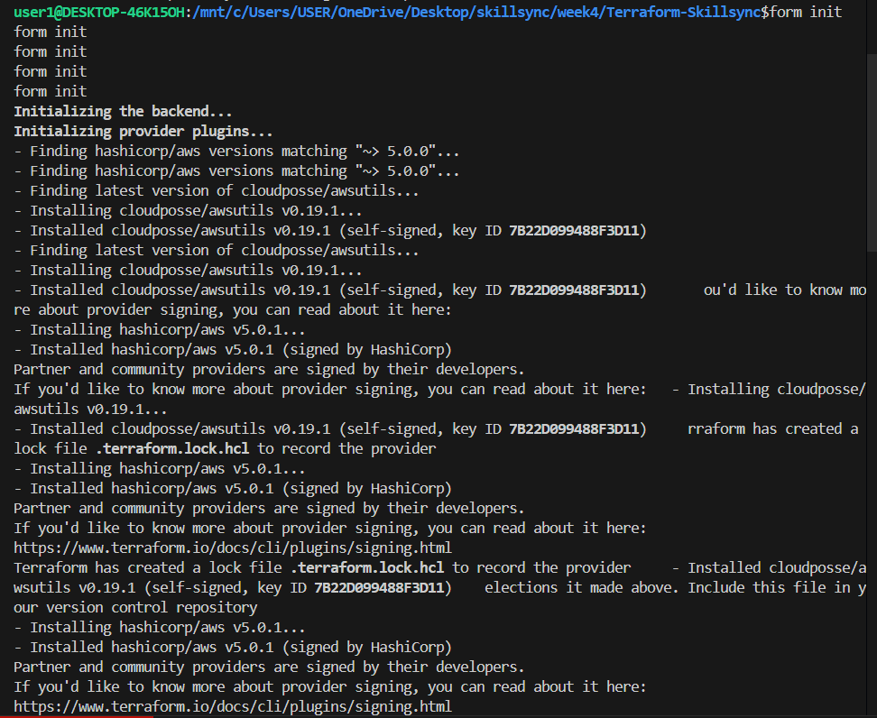
- Terraform plan output
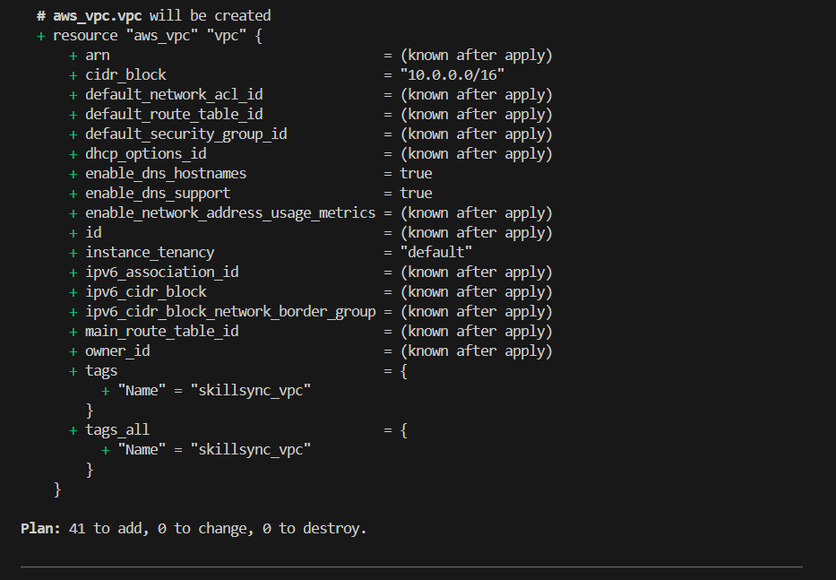
- Terraform apply output
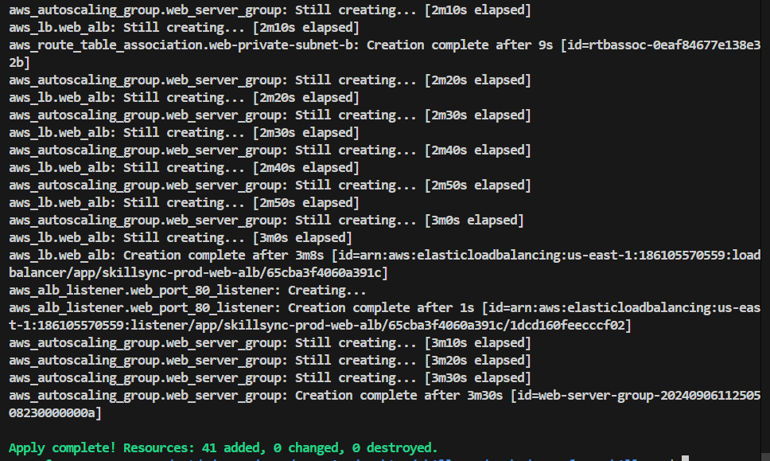
- AWS Console with created resources
1. VPC
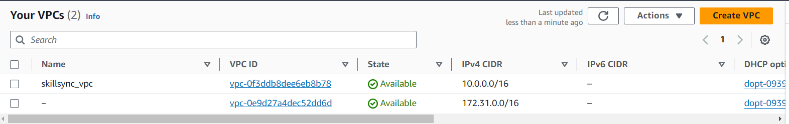
2. Other resources: subnets, route tables and gateways
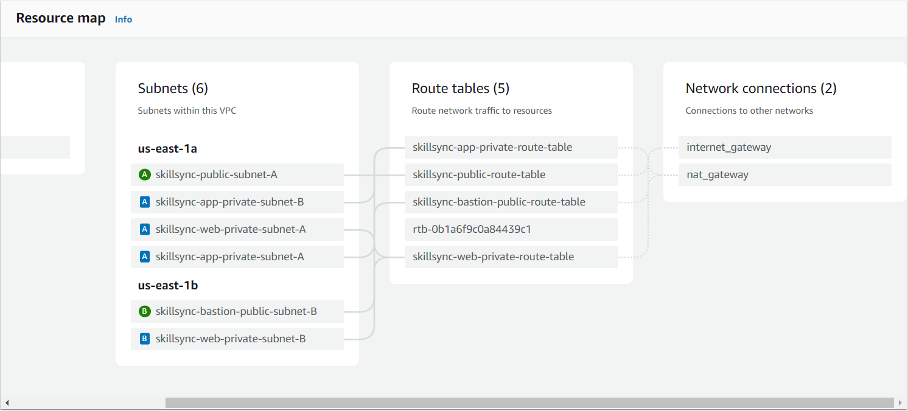
3. NACLs
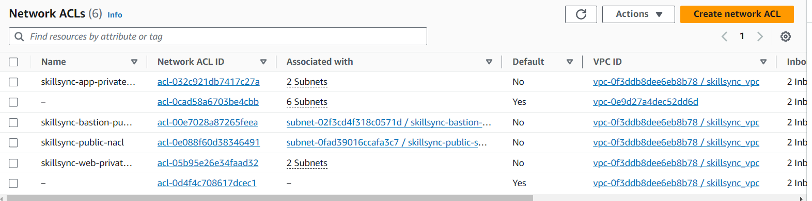
4. Instances
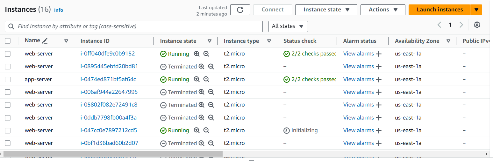
5. Security Groups
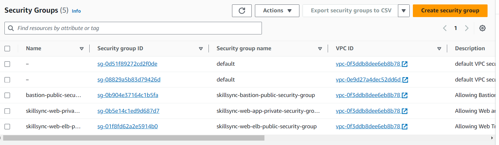
6. Load balancer
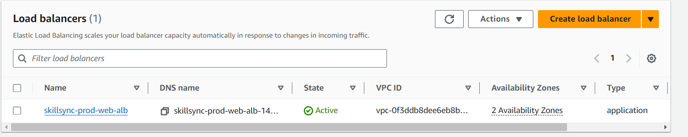
7. Auto Scaling Groups
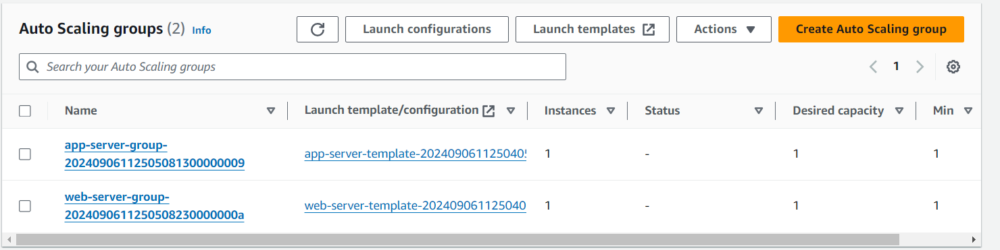
# Cleanup
To destroy the created resources, use the `terraform destroy` command.
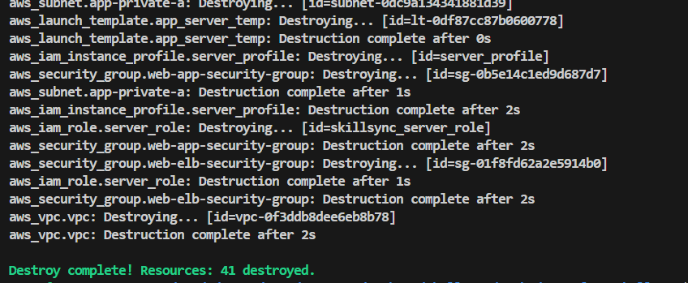